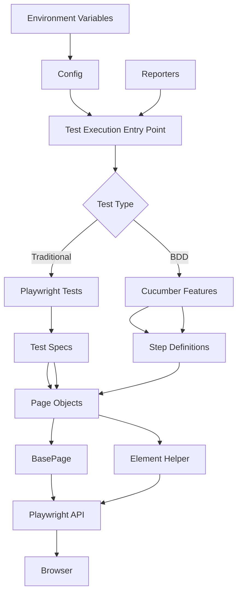
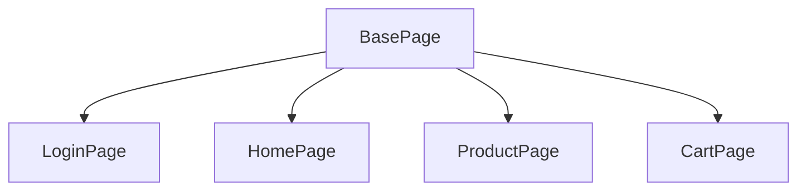
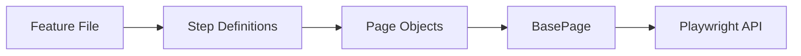

# Framework Implementation Details - Playwright Test Automation

## 📋 Table of Contents
1. [Framework Architecture](#framework-architecture)
2. [Folder Structure](#folder-structure)
3. [Core Components](#core-components)
4. [Design Patterns](#design-patterns)
5. [Locator Strategies](#locator-strategies)
6. [Configuration Management](#configuration-management)
7. [Reporting](#reporting)

---

## Framework Architecture

### High-Level Overview



### Technology Stack

| Component | Technology | Purpose |
|-----------|-----------|---------|
| **Test Framework** | Playwright | Core automation framework |
| **BDD Framework** | Cucumber.js | Behavior-driven development |
| **Language** | JavaScript (ES6+) | Implementation language |
| **Package Manager** | npm | Dependency management |
| **Reporting** | HTML, JSON, Allure | Multi-format test reporting |
| **Configuration** | dotenv | Environment variable management |

---

## Folder Structure

```
automationteststore-playwright-tests/
│
├── config/                      # Configuration files
│   └── config.js               # Centralized configuration
│
├── pages/                       # Page Object Model (POM)
│   ├── LoginPage.js            # Login page actions & selectors
│   ├── HomePage.js             # Home page actions & selectors
│   ├── ProductPage.js          # Product page actions & selectors
│   └── CartPage.js             # Cart page actions & selectors
│
├── utils/                       # Utility/Helper files
│   ├── BasePage.js             # Base class for all page objects
│   └── ElementHelper.js        # Element interaction utilities
│
├── tests/                       # Traditional Playwright tests
│   ├── scenario1.spec.js       # E-commerce flow test
│   ├── scenario2.spec.js       # Multi-category shopping test
│   ├── scenario3.spec.js       # Skincare section test
│   └── scenario4.spec.js       # Men's section test
│
├── features/                    # BDD Cucumber feature files
│   ├── scenario1.feature       # Gherkin scenarios
│   ├── scenario2.feature
│   ├── scenario3.feature
│   └── scenario4.feature
│
├── steps/                       # Cucumber step definitions
│   ├── common.steps.js         # Shared step definitions
│   ├── scenario1.steps.js      # Scenario-specific steps
│   ├── scenario2.steps.js
│   ├── scenario3.steps.js
│   └── scenario4.steps.js
│
├── support/                     # Test support files
│   ├── hooks.js                # Before/After hooks
│   └── fixtures.js             # Test fixtures & context
│
├── docs/                        # Documentation
│   ├── SELECTOR_GUIDELINES.md
│   └── project_structure_explained.md
│
├── allure-results/             # Allure test results
├── playwright-report/          # Playwright HTML reports
├── test-results/               # Test execution artifacts
│
├── .env                        # Environment variables (gitignored)
├── .env.example                # Environment template
├── playwright.config.js        # Playwright configuration
├── cucumber.js                 # Cucumber configuration
├── package.json                # Project dependencies & scripts
└── README.md                   # Project overview
```

---

## Core Components

### 1. BasePage Class

**Purpose**: Provides reusable methods for all page objects to inherit

**Location**: [`utils/BasePage.js`](file:///c:/Users/Moiz-Work/Documents/Development/automationteststore-playwright-tests/utils/BasePage.js)

**Key Features**:
- Encapsulates common Playwright operations
- Provides auto-waiting mechanisms
- Supports multiple locator strategies
- Handles navigation and synchronization

**Core Methods**:

```javascript
class BasePage {
  // Element Interactions
  async click(locator)              // Click with auto-wait
  async fill(locator, value)        // Fill input with auto-wait
  async selectOption(locator, value) // Select dropdown option
  async getText(locator)            // Extract text content
  async isVisible(locator)          // Check visibility
  async scrollIntoView(locator)     // Scroll to element
  
  // Locator Strategies
  locator(selector)                 // CSS/XPath locator
  getByRole(role, options)          // Semantic role-based
  getByText(text, options)          // Text-based locator
  getByLabel(text, options)         // Label-based locator
  
  // Navigation & Waits
  async navigateTo(url, options)    // Navigate with options
  async waitForLoadState(state)     // Wait for page state
  async waitForSelector(selector)   // Explicit wait
  
  // Utilities
  getUrl()                          // Get current URL
  async getTitle()                  // Get page title
}
```

### 2. Page Objects

**Purpose**: Encapsulate page-specific logic and selectors

**Pattern**: Each page extends `BasePage`

**Example - LoginPage**:

```javascript
class LoginPage extends BasePage {
  async navigateToLogin() {
    const loginUrl = `${process.env.BASE_URL}index.php?rt=account/login`;
    await this.navigateTo(loginUrl);
    await expect(this.locator('//form[@id="loginFrm"]')).toBeVisible();
  }

  async login(username, password) {
    const usernameField = this.locator('#loginFrm_loginname');
    const passwordField = this.locator('#loginFrm_password');
    const loginButton = this.getByRole('button', { name: 'Login' });
    
    await this.fill(usernameField, username);
    await this.fill(passwordField, password);
    await this.click(loginButton);
    
    await this.page.waitForLoadState('domcontentloaded');
  }
}
```

### 3. Test Specifications

**Purpose**: Define test scenarios using Playwright test runner

**Location**: `tests/` directory

**Structure**:

```javascript
const { test } = require('@playwright/test');
const { LoginPage } = require('../pages/LoginPage');
const { HomePage } = require('../pages/HomePage');

test.describe('Scenario 1: Complete E-commerce Flow', () => {
  test('Login → Home → Add to Cart → Verify', async ({ page }) => {
    const loginPage = new LoginPage(page);
    const homePage = new HomePage(page);
    
    await loginPage.navigateToLogin();
    await loginPage.login(username, password);
    await homePage.clickHomeNav();
    // ... more actions
  });
});
```

### 4. BDD Components

#### Feature Files (Gherkin)

**Purpose**: Business-readable test scenarios

**Location**: `features/` directory

```gherkin
Feature: Complete E-commerce Flow

  Scenario: User logs in and adds newest Dove product to cart
    Given I am on the login page
    When I login with valid credentials
    And I navigate to the home page
    And I click on the Dove brand from the carousel
    And I add the newest item to the cart
    Then I should see 1 item in the cart
```

#### Step Definitions

**Purpose**: Map Gherkin steps to executable code

**Location**: `steps/` directory

```javascript
const { Given, When, Then } = require('@cucumber/cucumber');

Given('I am on the login page', async function () {
  await this.loginPage.navigateToLogin();
});

When('I login with valid credentials', async function () {
  await this.loginPage.login(this.username, this.password);
});

Then('I should see {int} item in the cart', async function (count) {
  await this.cartPage.assertItemInCart(count);
});
```

### 5. Hooks & Fixtures

**Purpose**: Setup and teardown for tests

**Location**: `support/hooks.js`, `support/fixtures.js`

```javascript
// hooks.js
const { Before, After, BeforeAll, AfterAll } = require('@cucumber/cucumber');

Before(async function () {
  this.page = await this.context.newPage();
  // Initialize page objects
  this.loginPage = new LoginPage(this.page);
  this.homePage = new HomePage(this.page);
});

After(async function () {
  await this.page.close();
});
```

---

## Design Patterns

### 1. Page Object Model (POM)

**Benefits**:
- ✅ Separation of concerns
- ✅ Code reusability
- ✅ Easy maintenance
- ✅ Reduced code duplication

**Implementation**:
- Each page is a class extending `BasePage`
- Selectors and actions are encapsulated
- Tests interact with page objects, not raw selectors

### 2. Inheritance Pattern



### 3. Dependency Injection

- Page objects receive `page` instance via constructor
- Configuration injected via environment variables
- Test data passed through fixtures

### 4. BDD Pattern



---

## Locator Strategies

### 1. XPath Selectors

**Usage**: Precise element identification when CSS is insufficient

**Examples**:
```javascript
// Form locator
this.locator('//form[@id="loginFrm"]')

// Text-based locator
this.locator('//a[contains(text(),"Welcome back")]')

// Indexed element
this.locator('(//div[@class="product"])[1]')

// Attribute-based
this.locator('//button[@type="submit"]')
```

**Pros**:
- ✅ Powerful traversal capabilities
- ✅ Can navigate up/down DOM tree
- ✅ Text-based selection

**Cons**:
- ❌ Can be brittle with DOM changes
- ❌ Slower than CSS selectors

### 2. CSS Selectors

**Usage**: Fast, simple element selection

**Examples**:
```javascript
// ID selector
this.locator('#loginFrm_loginname')

// Class selector
this.locator('.product-card')

// Attribute selector
this.locator('[data-testid="add-to-cart"]')

// Nth-child
this.locator('.product:nth-child(2)')
```

**Pros**:
- ✅ Fast execution
- ✅ Simple syntax
- ✅ Good browser support

**Cons**:
- ❌ Limited traversal capabilities
- ❌ No text-based selection

### 3. Role-Based Selectors (Playwright Specific)

**Usage**: Semantic, accessibility-friendly locators

**Examples**:
```javascript
// Button by name
this.getByRole('button', { name: 'Login' })

// Link by name
this.getByRole('link', { name: 'Home' })

// Textbox by label
this.getByRole('textbox', { name: 'Username' })
```

**Pros**:
- ✅ Accessibility-friendly
- ✅ Resilient to DOM changes
- ✅ Self-documenting

**Cons**:
- ❌ Requires proper ARIA roles
- ❌ Not always available

### 4. Text-Based Selectors

**Examples**:
```javascript
// Exact text match
this.getByText('Add to Cart')

// Partial text match
this.getByText(/Add to/i)

// Case-insensitive
this.getByText('login', { exact: false })
```

### 5. Test ID Selectors (Best Practice)

**Usage**: Custom data attributes for testing

**Example**:
```html
<button data-testid="submit-button">Submit</button>
```

```javascript
this.locator('[data-testid="submit-button"]')
// or
this.getByTestId('submit-button')
```

**Pros**:
- ✅ Most stable locator strategy
- ✅ Independent of UI changes
- ✅ Clear testing intent

---

## Configuration Management

### 1. Environment Variables (.env)

```env
# Application
BASE_URL=https://automationteststore.com/

# Credentials
USERNAME=Qanita12
PASSWORD=Qanita123

# Browser Settings
BROWSER=chromium          # chromium, firefox, webkit, all
HEADLESS=false            # true for headless mode

# Timeouts (milliseconds)
ACTION_TIMEOUT=15000
NAVIGATION_TIMEOUT=20000
TEST_TIMEOUT=180000

# Performance
SLOW_MO=100              # Slow down operations by 100ms
```

### 2. Playwright Configuration

**File**: [`playwright.config.js`](file:///c:/Users/Moiz-Work/Documents/Development/automationteststore-playwright-tests/playwright.config.js)

```javascript
module.exports = defineConfig({
  testDir: './tests',
  fullyParallel: true,
  retries: IS_CI ? 2 : 0,
  workers: IS_CI ? 1 : undefined,
  
  reporter: [
    ['html'],
    ['json', { outputFile: 'test-results/results.json' }],
    ['allure-playwright', { outputFolder: 'allure-results' }],
  ],
  
  timeout: 180000,
  
  use: {
    baseURL: BASE_URL,
    headless: HEADLESS,
    viewport: { width: 1280, height: 720 },
    actionTimeout: 90000,
    screenshot: 'only-on-failure',
    video: 'retain-on-failure',
    trace: 'on-first-retry',
  },
  
  projects: [
    { name: 'chromium', use: { ...devices['Desktop Chrome'] } },
    { name: 'firefox', use: { ...devices['Desktop Firefox'] } },
  ],
});
```

### 3. Cucumber Configuration

**File**: `cucumber.js`

```javascript
module.exports = {
  default: {
    require: ['steps/**/*.js', 'support/**/*.js'],
    format: ['progress', 'html:cucumber-report.html'],
    paths: ['features/**/*.feature'],
  }
};
```

---

## Reporting

### 1. HTML Report (Built-in)

**Command**: `npx playwright show-report`

**Features**:
- Interactive test results
- Screenshots on failure
- Video recordings
- Trace viewer integration

**Output**: `playwright-report/index.html`

### 2. JSON Report

**Configuration**:
```javascript
['json', { outputFile: 'test-results/results.json' }]
```

**Use Case**: CI/CD integration, custom reporting

### 3. Allure Report

**Configuration**:
```javascript
['allure-playwright', { outputFolder: 'allure-results' }]
```

**Generate Report**:
```bash
npm run report:allure
```

**Features**:
- Rich visualizations
- Historical trends
- Test categorization
- Detailed step breakdown

### 5. Cucumber HTML Report

**Output**: `cucumber-report.html`

**Features**:
- Gherkin scenario visualization
- Step-by-step execution
- Pass/fail status
- Execution time

---

## Key Implementation Highlights

### Auto-Waiting Mechanism

Playwright automatically waits for elements to be:
- ✅ Attached to DOM
- ✅ Visible
- ✅ Stable (not animating)
- ✅ Enabled
- ✅ Not obscured

**Example**:
```javascript
// No explicit wait needed
await page.click('button'); // Waits automatically
```

### Error Handling

```javascript
try {
  await loginPage.login(username, password);
} catch (error) {
  console.error('Login failed:', error);
  throw error; // Re-throw for test failure
}
```

### Assertions

```javascript
const { expect } = require('@playwright/test');

// Visibility assertion
await expect(loginButton).toBeVisible();

// URL assertion
await expect(page).toHaveURL(/dashboard/);

// Count assertion
await expect(cartItems).toHaveCount(2);

// Text assertion
await expect(heading).toHaveText('Welcome');
```

### Synchronization Strategies

```javascript
// Wait for network idle
await page.waitForLoadState('networkidle');

// Wait for DOM content loaded
await page.waitForLoadState('domcontentloaded');

// Wait for specific element
await page.waitForSelector('.product-list');

// Wait for timeout (use sparingly)
await page.waitForTimeout(1000);
```

---

## Summary

This Playwright framework implements:

1. **Page Object Model** for maintainability
2. **BDD support** for business readability
3. **Multiple locator strategies** for flexibility
4. **Comprehensive reporting** for visibility
5. **Environment-based configuration** for portability
6. **Auto-waiting** for reliability
7. **Cross-browser support** for coverage

The architecture is **scalable**, **maintainable**, and follows **industry best practices** for test automation.
